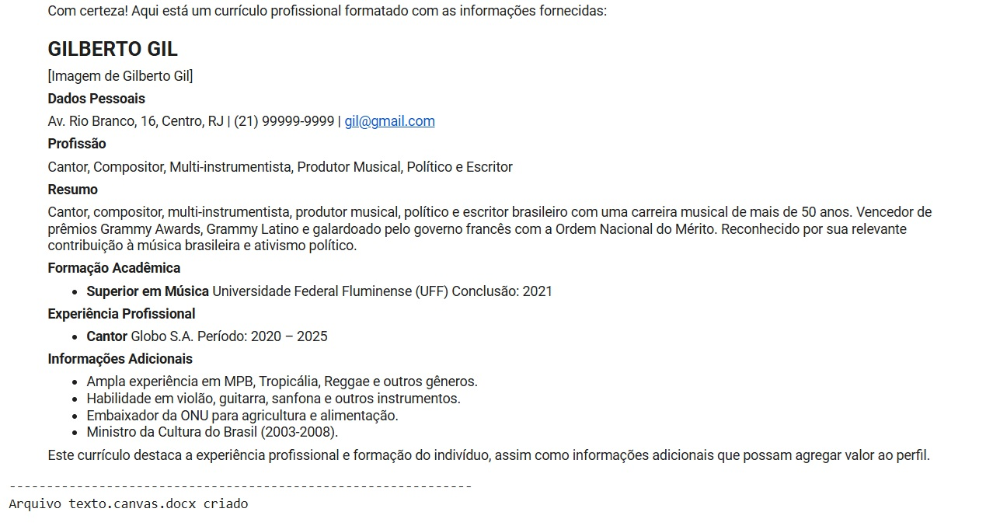
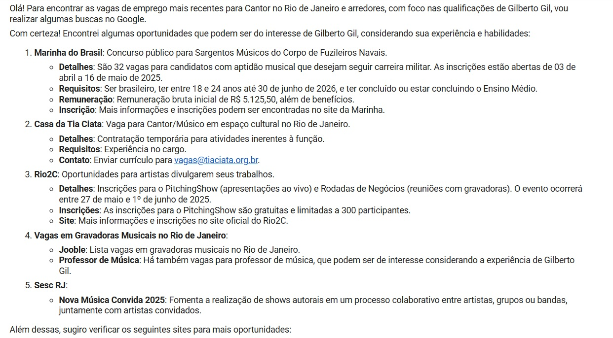
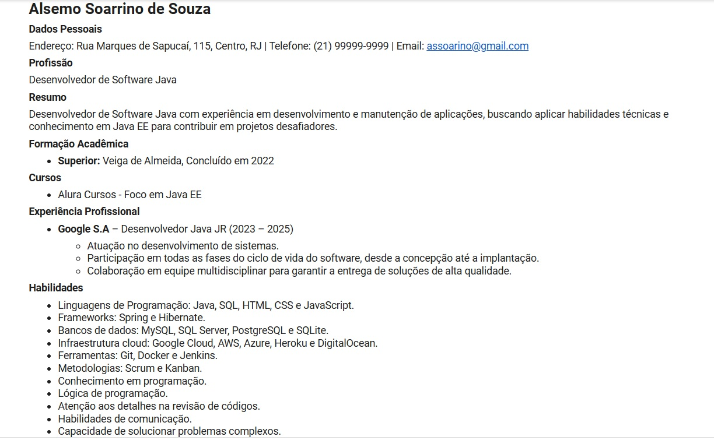

✨ AGENTE HELP CURRICULOS ✨


## 🛠️ SOBRE O PROJETO:

Um sistema - Agent do Google Gemini que realiza:
- Cadastro de informações; 
- Criação de currículo profissional; 
- Exporta o currículo para um arquivo.DOCX;
- Cria uma SUPER LISTA de vagas conforme o currículo cadastrado;
- Exporta a SUPER LISTA de vagas para um arquivo.DOCX;

## 🤝 Motivação para este projeto:
 - Ajudar as pessoas a criar um currículo.
 - Ajudar as pessoas a encontrar vagas de emprego.
 - Ajudar pessoas que não sabem ler, escrever, ou tem dificuldade com tecnologia.
 - Ajudar pessoas a encontrar vagas com acessíbilidade.

## 💻 Como Executar o Projeto

Siga estas etapas para executar o sistema localmente:

1.  **Clone o repositório:**
    ```bash
    git clone [https://docs.github.com/en/repositories/archiving-a-github-repository/referencing-and-citing-content](https://docs.github.com/en/repositories/archiving-a-github-repository/referencing-and-citing-content)
    cd [nome do seu repositório]
    ```
2.  **Inserir os arquivos ou importar em seu Google Colab :**
    **Lembrar de gerar e ativar a sua chave GOOGLE, por fim Connectar e rodar** 

## ⚙️ Exemplo 1 "O Cadastro": 


## ⚙️ Exemplo 2 "A Super Lista de Vagas":


## ⚙️ Exemplo 3 "Os Arquivos .DOCX":


## ⚙️ Exemplo 4 outro modelo de cadastro:



📧 Contato
[Ary Vitor Souza da Silva] - [ary99.souza@gmail.com] - [[Ary Vitor - Link para o Linkedin](http://www.linkedin.com/in/ary-vitor-souza41925246)]
[[Ary Vitor - Link do Repositório no GitHub](https://github.com/aryvitorss)]

✨ Construído e elaborado por [Ary Vitor Souza da Silva] ✨
